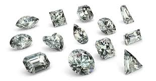

# Diamond-Prices-Machine-Learning

# Data set description

This classic dataset contains the prices and other attributes of almost 54,000 diamonds. It's a great dataset for beginners learning to work with data analysis and visualization. Dataset is available at [kaggle.com](https://www.kaggle.com/shivam2503/diamonds)

Features:
- price: price in US dollars (\$326--\$18,823)
- carat: weight of the diamond (0.2--5.01)
- cut: quality of the cut (Fair, Good, Very Good, Premium, Ideal)
- color: diamond colour, from J (worst) to D (best)
- clarity a measurement of how clear the diamond is (I1 (worst), SI2, SI1, VS2, VS1, VVS2, VVS1, IF (best))
- x: length in mm (0--10.74)
- y: width in mm (0--58.9)
- z: depth in mm (0--31.8)
- depth: total depth percentage = z / mean(x, y) = 2 * z / (x + y) (43--79)
- table: width of top of diamond relative to widest point (43--95)

# Data Cleaning

1. Check for missing values
2. Check for Duplicate data
3. Correlation between features
4. Check distribution of features and outliers

# Data transformation

1. OneHot Encoding using pandas.get_dummies for categorical features
2. StandardScaler from sklearn

# Linear Models from sklearn

1. LinearRegression
2. LogisticRegression
3. Lasso
4. Ridge
5. LassoLars
6. BayesianRidge
7. ElasticNet

# Decision Tree models from sklearn

1. DesicionTreeClassifier
2. RandomForrestClassifier
3. GradientboostingClassifier

# Support Vector Machines

# Mertics used to evaluate the models from sklearn

1. max_error
2. median_absolute_error
3. mean_squared_error
4. r2_score
5. explained_variance_score
6. confusion_metrics
7. accuracy_score
8. classification_report

# Deep Learning Model with TensorFlow

